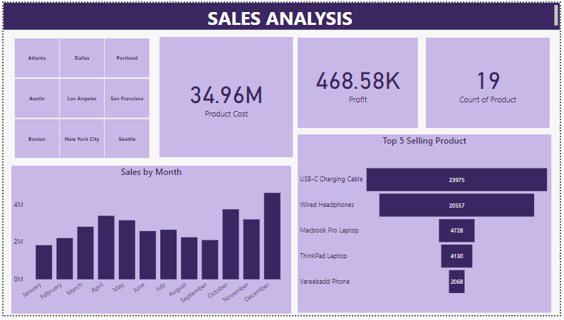

# Sales-MeriSkill

### Introduction
Being part of the MeriSKILL Vitual Internship Program, here is my first project. This project is based on Sales.

### Problem Statement
The purpose of this project is to:
- Identify trends
- Identify the top selling product
- Calculate revenue: Total Sales and Profit magins

### Tools Required
The tools required for this project are Power BI and MSExcel. MSExcel for data cleaning and Power BI for DAX and creating dashboard

### Data Cleaning
Clean data is a key influence in a project. The dataset was clean, no missing values or duplicate.

### Data Visualization

### Conlcusion
From the above visual, here is the solution to the problem statements:
##### Trends
* Sales increases from January to April
* Sales decreases from May to September
* October and December has the highest sales
##### Top selling Product
The top five selling product are:
* USB-C Charging Cables
* Wired Headset
* Macbook Pro laptop
* Thinkpad Laptop
* Vareebadd Phone
##### Revenue
* The total sales is 34.96 Million
* Total profit is 468.58 Thousand.
